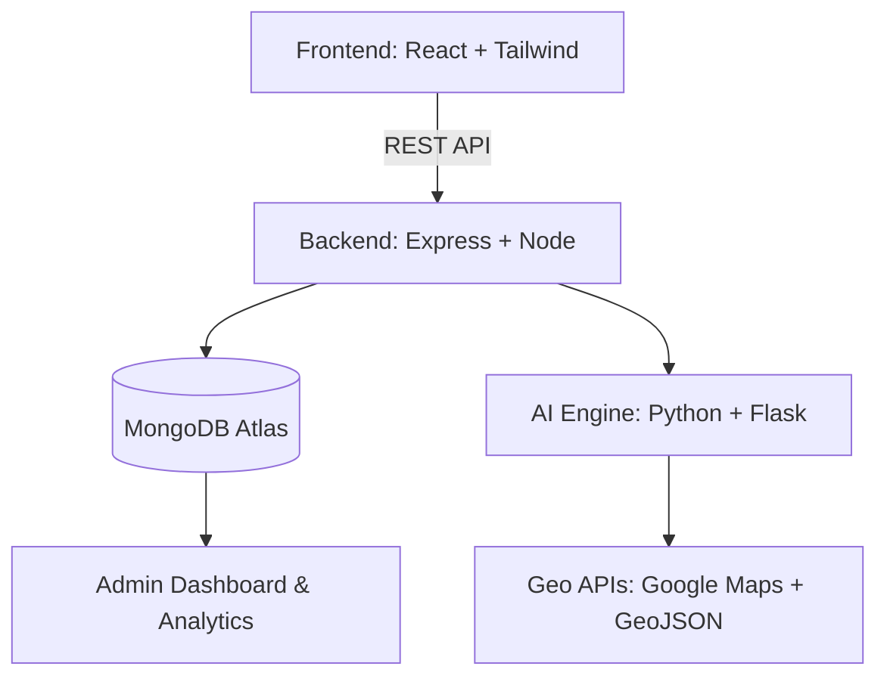

<!-- RAKT: Blood Bank Management System README -->

<p align="center">
  
</p>

<p align="center">
  
  
  
  
</p>

---

<h2 align="center">🚀 A Next-Gen AI & Geospatial Platform to Revolutionize Blood Management</h2>

<p align="center">
  
</p>

---

## 🌟 Overview

**RAKT (रक्त)** is a cutting-edge **Token & Location-Based Blood Bank Management System** built on the powerful **MERN Stack**, enhanced with **AI-driven donor matching** and **geospatial intelligence**.

Say goodbye to manual delays—RAKT automates the entire process of blood donation, matching, and logistics with:

- **Tokenized transaction tracking**
- **Real-time geolocation for donors and hospitals**
- **AI-powered donor recommendations**
- **Secure, multi-role authentication**
- **Automated notifications & analytics**

<p align="center">
  
  
  
</p>

---

## ✨ Key Features

| 🚀 **Feature**             | 💡 **Description**                                                                 |
|---------------------------|------------------------------------------------------------------------------------|
| 🩸 **Tokenized Requests**  | Every donation and request is traceable through unique, auditable tokens.          |
| 🧭 **Real-Time Location**  | Google Maps & GeoJSON integration for instant mapping of donors and hospitals.     |
| 🧠 **AI-Powered Matching** | Suggests the most suitable donor by blood type, distance, and current availability.|
| 🔐 **JWT Security**        | Advanced authentication for Admin, Donor, and Hospital roles.                      |
| 📊 **Smart Dashboards**    | Role-based analytics, donor history, and availability heatmaps.                    |
| 📩 **Auto Notifications**  | Instant alerts via Email and SMS APIs for requests and updates.                    |

---

## 🧭 System Architecture



### 🧱 Tech Stack

<p align="center">
  
</p>

---

## 🚀 Getting Started

1. **Clone the repository**
   ```bash
   git clone https://github.com/PriyankaAsthana/RAKT_Blood_Bank_Management.git
   cd RAKT_Blood_Bank_Management
   ```
2. **Install dependencies**
   ```bash
   npm install
   # For backend and AI modules, navigate into their folders and install requirements as needed.
   ```
3. **Set up environment variables**
   - Add your MongoDB URI, email/SMS API keys and other secrets to `.env` files as per the documentation.

4. **Run the application**
   ```bash
   npm start
   # or use nodemon/backend/AI module runners as configured
   ```

---

## 🔮 Future Roadmap

- ✅ **Phase I** – MERN Stack core + Token System
- 🚧 **Phase II** – AI donor recommendation engine
- 🌐 **Phase III** – Cloud deployment + Geospatial mapping
- 💫 **Phase IV** – Blockchain-based traceability
- 🤖 **Phase V** – NLP chatbot for donor assistance

---

## 📊 UI Snapshots

<p align="center">
  
  <br/>
  <sub><i>Dynamic dashboards and AI-powered donor matching in action</i></sub>
</p>

---

## 🧠 Research Context

> **RAKT: Token & Location-Based Blood Bank Management System (2025)**
>
> Combines AI-driven logistics, geospatial analytics, and tokenized data flow to modernize and secure medical supply chains.
>
> - Under peer review (2025)
> - Aligns with [UN SDG 3 – Good Health & Well-being](https://sdgs.un.org/goals/goal3) and [SDG 9 – Industry, Innovation & Infrastructure](https://sdgs.un.org/goals/goal9)

---

## 👩‍💻 Author

**Priyanka Asthana**  
🎓 B.Tech (Hons) CSE | Minor in Robotics  
📍 India  
- [Portfolio](#) <!-- Update with actual link -->
- [LinkedIn](#) <!-- Update with actual link -->
- [GitHub](https://github.com/PriyankaAsthana)
- 📧 [asthanapriyanka829@gmail.com](mailto:asthanapriyanka829@gmail.com)

---

<h3 align="center">🌟 Show some ❤️ by starring the repo! 🌟</h3>
<p align="center">
  
</p>
<p align="center">
  
</p>

---

<details>
<summary><b>🔗 Useful Links</b></summary>

- [MERN Stack Documentation](https://www.mongodb.com/mern-stack)
- [GeoJSON Format](https://geojson.org/)
- [JWT Authentication](https://jwt.io/)
- [Google Maps Platform](https://developers.google.com/maps)
- [UN Sustainable Development Goals](https://sdgs.un.org/goals)
</details>

---
